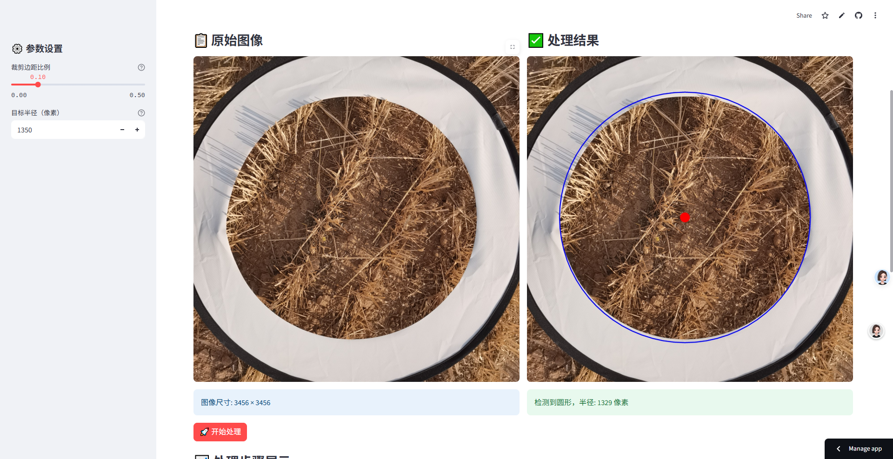

# 🔍 麦框识别工具

一款专门用于识别和标准化圆形麦框的图像处理工具。



## ✨ 主要功能

- 🔍 检测图像中的圆形麦框
- ✂️ 裁剪圆形区域
- 📏 将圆形统一缩放到标准尺寸
- 📦 支持批量处理多个图像
- 💾 一键导出处理结果

## 🚀 快速开始

### 本地运行

1. 安装依赖：
```shell
git clone https://github.com/nwafufhy/CircleNorm.git
cd CircleNorm
pip install -r requirements.txt
streamlit run main.py
```
### 在线使用🌐
直接访问在线版本： [🔍 麦框识别工具](https://nwafufhy-circlenorm-main-fhqag0.streamlit.app/)

## 💡 使用说明
### 参数设置
- 🎚️ 裁剪边距比例 ：设置裁剪时保留的额外边距（0.0-0.5）
- 📐 目标半径 ：设置标准化后的圆形半径（100-3000像素）
### 使用模式
1. 📷 单图处理
   
   - 上传单张图像
   - 实时预览处理效果
   - 分步查看处理过程
   - 单独下载处理结果
2. 📁 批量处理
   
   - 同时上传多张图像
   - 批量自动处理
   - 预览处理结果
   - 打包下载所有结果
## ⚙️ 技术特性
- 🎯 基于轮廓检测的圆形识别
## 📌 注意事项
- 📸 支持格式：JPG、PNG、BMP
## 🤝 贡献
欢迎贡献代码和反馈问题！

## 📄 许可证
MIT License